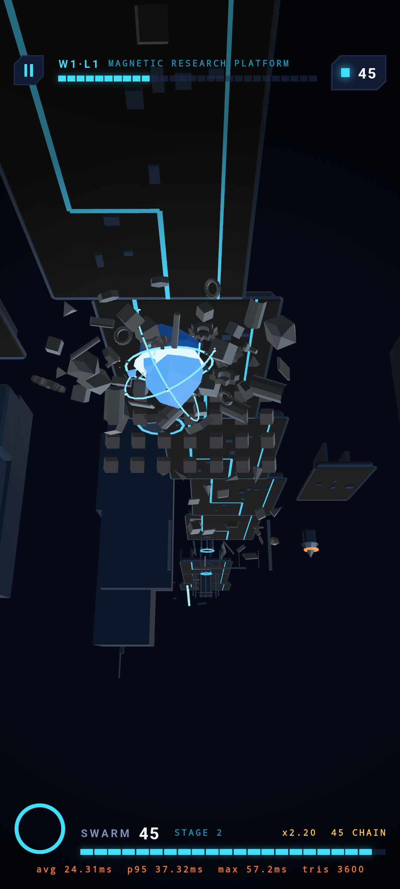

# MAGNET RUSH

### ATTRACT. CHARGE. BLAST.

A one-finger 3D action game for Android. You control the **Kanban Core**, a
magnetic crystal that tears metal out of a floating research facility and turns
it into a violent orbiting storm.

There is exactly one control:

* **Hold** — attract. Metal flies in on curved magnetic paths and locks into
  orbit. Charge builds. Hold too long and the Core overloads and vents.
* **Release** — repel. The swarm launches forward, walls come apart, the camera
  kicks.

> **Project status: a playable Level 1 vertical slice.** One level of a planned
> fifty. Read `docs/known_limitations.md` before anything else — it states
> plainly what is verified on device, what is only unit-tested, and what does
> not exist.



## What works

* **Level 1, end to end in the normal app flow** — home → PLAY → gameplay →
  results/failure → retry. No developer harness.
* **The Kanban Core** as a real hero asset: 11 separable Blender parts animated
  at runtime — shell caps that split apart with charge, an energy chamber
  glowing through a tilted seam, emissive cracks, three gyroscopic rings, and
  orbiting crystal fragments.
* **A swarm that reads as torn-out machinery** — Blender-authored bolts, nuts,
  gears, rods, plates, rings and scrap in three orbit layers, all drawn in
  **one** merged dynamic mesh.
* **A composed environment** — 20 modular platform and obstacle assets forming a
  floating facility with foreground lane, midground ledges and towers, and
  background silhouettes.
* Attraction with no perceptible input delay, a fair perfect-release window,
  wall destruction, pooled mesh particles, trails, shockwaves, a damped
  three-quarter follow camera with impulses and zones, a bespoke UI, synthesized
  audio, rate-limited haptics, quality presets, reduced motion.
* `flutter analyze` clean · **91 tests passing** · debug APK, release APK and
  release AAB all build and launch.

## What does not

1 of 50 levels. No enemies, no bosses, no upgrades, no shop, no persistence of
progress, no monetization, no store prep. Performance is emulator-only — **60 FPS
is not demonstrated on real hardware.** See `docs/known_limitations.md`.

## Quick start

```sh
flutter pub get
flutter run --release
```

```sh
# with the frame-time overlay
flutter run --release --dart-define=MR_STATS=true

# regenerate every 3D asset from source (Blender 5.2)
blender --background --python art/blender/build_assets.py
python tool/asset_audit.py          # regenerates docs/asset_manifest.md

# renderer regression harness (not the game)
flutter run -t lib/dev/smoke_test.dart --release
```

Requires Flutter **stable 3.44.8**, Android SDK 36, JDK 17. Flutter GPU needs
`flutter config --enable-native-assets` once.

## Layout

```
lib/
  app/            application shell (WidgetsApp — deliberately not Material)
  core/           audio, haptics, persistence, performance
  game/
    renderer/     mesh templates, GLB→CPU loader, the batcher
    player/       the Kanban Core and its animation states
    magnet/       attraction physics
    swarm/        orbit layers, capture, release
    camera/       the follow rig
    effects/      pooled mesh particles, trails, shockwaves
    levels/       level data, parser, validator
    scoring/      charge window, combo, results
    game_world.dart   loading, simulation, encounter sequencing
  features/       home, gameplay, results, settings
  shared/         theme and widgets
  dev/            renderer regression harness only

art/blender/      asset generators; src/*.blend editable sources
assets/levels/    level_01.json — the level is data, not code
assets/models/    80 generated GLBs
tool/             device capture, measurement, asset audit
```

## Technology

| | |
|---|---|
| App shell, UI, meta | Flutter (stable 3.44.8) |
| Gameplay 3D | `flutter_scene` 0.16.0 (vendored + patched) on Flutter GPU / Impeller |
| Backend | Impeller Vulkan preferred, GLES 3.0 supported |
| Swarm | One merged dynamic mesh rebuilt per frame — N objects, 1 draw call |
| Physics | Custom deterministic kinematics; no rigid-body engine |
| Art | Blender 5.2, driven interactively through Blender MCP; flat-shaded low-poly, no textures |
| Audio | Synthesized as PCM in Dart at boot — no samples shipped, nothing to license |

The reasoning, the alternatives rejected and the measurements are in
`docs/renderer_decision.md`.

## Documentation

| Document | Contents |
|---|---|
| `docs/known_limitations.md` | **Honest status — read this first** |
| `docs/game_design.md` | The loop, game feel, the perfect-release window, accessibility |
| `docs/level_design.md` | Level 1 beat by beat, composition rules, every validator rule |
| `docs/renderer_decision.md` | Renderer/physics choice, benchmarks, the GLES crash |
| `docs/blender_pipeline.md` | How assets are authored and the conventions enforced |
| `docs/asset_manifest.md` | Generated table of all 80 assets |
| `docs/testing_report.md` | Every test, and every bug testing caught |
| `docs/performance_report.md` | Measured frame times, and what was not measured |
